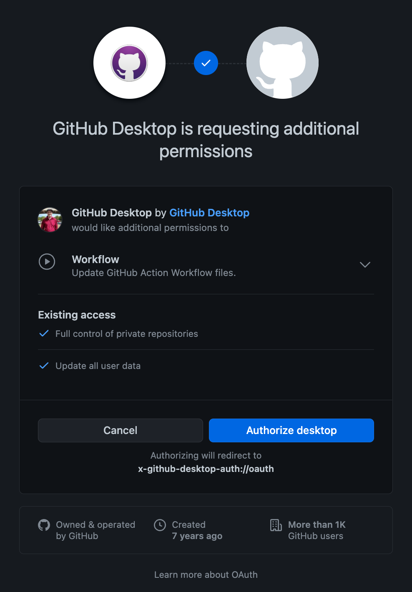
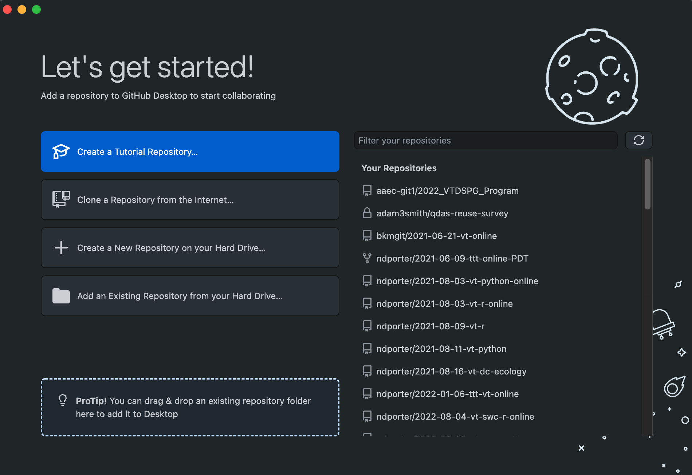
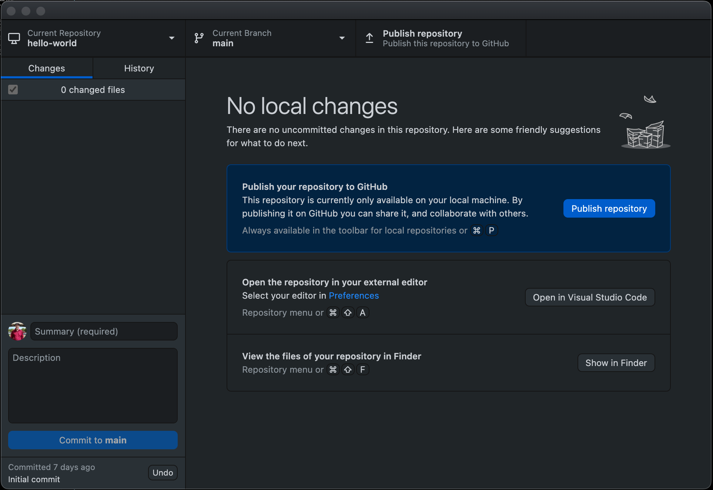
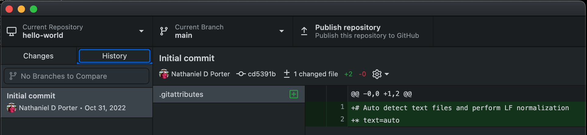

### Setting up GitHub Desktop

When we use GitHub Desktop on a new computer for the first time,
we need to configure a few things. The first step is to log into Github Desktop so it can access information and repositories tied to our account.

To do so, log into GitHub on your browser, then open Github Desktop and click "Sign into Github.com". This should open a new tab in your browser
asking you to authorize GitHub Desktop. 

Once you click authorize, you will need to reenter your GitHub password then choose whether to use the name and email on your GitHub account (recommended) or change them.

After this, you should see a start screen that resembles the image below. If you haven't used Github before, you won't see any repositories, but we'll fix that soon enough.

> ## Options and Preferences
> 
> Optionally, before going on, take a minute to browse some of the general settings for GitHub Desktop (`GitHib Desktop - Preferences` on Mac; 
> `File - Options` on Windows). The `Accounts` screen should show your logged-in GitHub account. 
> Your name and email should be correct (and generally match your GitHub account) in `Git` and `main` should be selected as the default branch name.
> `master` used to be the default for most Git repositories but was replaced due to association with slavery. 
> `Appearance` also allows you to choose light or dark themes. 
> Click `Save` if you changed anything and close out of the options window before continuing.
{: .callout}

### Creating a repository

A Git **repository** is a data structure used to track changes to a set of project files over time. Repositories are
stored within the same directory as these project files, in a hidden directory called `.git`. We can create a new git
repository either by using [GitHub's web interface](https://github.com/new) or in GitHub Desktop. 
Let's use the the app to create a git repository for the experiments that we're going to do today. Start by clicking the `Create a New Repository on your Hard Drive` button.

The name we give to the repository will be created as a new directory within the directory chosen as `Local Path`. In general, try to give repositories short descriptive names using only letters, numbers, dashes, and underscores. For now, name your repository `hello-world`, leave the other options unchanged, and click `Create Repository`.

### Using Git

One of the main barriers to getting started with Git is understanding the terminology necessary to execute commands. Although some of the language used in Git aligns with common-use words in English, other terms are not so clear. The best way to learn Git terminology - which consists of a number of verbs such as add, commit and push - is to use it, which is what we will be doing during this lesson. We will explain these commands as we proceed from setting up a new version-controlled project to publishing our own website.

On a command line interface, Git commands are written as `git verb options`,
where `verb` is what we actually want to do and `options` is additional optional information which may be needed for the `verb`. So let's get started with our setup. 
While we won't use the command line today, there will be notes here in case you end up using it later, so you can connect what we're doing to standard Git terminology.

The `Create Repository` button first creates a new directory for our project, then **initializes** an empty git repository to track changes to our project. 
On the command line, this corresponds to the **mkdir** (make directory) and **git init** (initialize) commands.

~~~
$ mkdir hello-world
$ cd hello-world
$ git init
~~~
{: .language-bash }
~~~
Initialized empty Git repository in <your file path>/hello-world/.git/
~~~
{: .output}

The `hello-world` directory is now a git repository.

In GitHub Desktop, you should see something like the screen below. We'll learn more about the elements of the interface and repository soon, but the below discussion provides a quick overview of what you see in the interface.

At the top, you can see that we are in the `hello-world` repository and on the `main` (default) branch. 

On the left, you should see a `Changes` tab showing no changes, because we haven't done anything beyond create the repository yet. 
As we add or change files, they'll appear here, and the options in the bottom left will help us track those changes when we're ready.
Since we aren't actively viewing a file, the main (right) area in the window provides some information and suggestions on what we might want to do next.

Clicking the `History` tab on the left allows us to view a list of changes over time in our repository (see below). We have only made a single commit (or update) to our repository, when we initialized it, which shows up on the left with a commit message ("initial commit"), user, and date. Each file that was changed, added, or deleted in that commit is visible in the middle column (here, just `.gitattributes`), and clicking on one shows each row that was changed, added, or deleted in that file during that commit.

If we click back on the `Changes` tab and choose `Show in Finder` or `Show in Explorer`, the repository might seem empty; however, GitHub Desktop has created a hidden `.git` directory and a hidden `.gitattributes` file. In general, files that start with a `.` are hidden because they are not meant to be edited by most users. Hidden files will still be included in the repository when we upload to GitHub, and can be viewed on the local computer by changing options.

### Displaying the current project's status

We can run the `git status` command to display the current state of a project. Let's do that now.

~~~
$ git status
~~~
{: .language-bash }
~~~
On branch main
No commits yet
nothing to commit (create/copy files and use "git add" to track)
~~~
{: .output}

The output tells us that we are on the main branch (more on this later) and that we have nothing to commit (no
unsaved changes).

### Two steps: Adding and committing

We will now create and save our first project file. This is a two-step process. First, we **add** any files for which
we want to save the changes to a staging area, then we **commit** those changes to the repository. This two-stage
process gives us fine-grained control over what should and should not be included in a particular commit.

Let's create a new file using the `touch` command, which is a quick way to create an empty file.

~~~
$ touch index.md
~~~
{: .language-bash }

The `.md` extension above signifies that we have chosen to use the Markdown format, a lightweight markup language with plain text formatting syntax. We will explore Markdown a bit later.

Let's check the status of our project again.

~~~
$ git status
~~~
{: .language-bash }
~~~
On branch main
No commits yet
Untracked files:
  (use "git add <file>..." to include in what will be committed)

    index.md

nothing added to commit but untracked files present (use "git add" to track)
~~~
{: .output}

This status is telling us that git has noticed a new file in our directory that we are not yet tracking. With colourised
output, the filename will appear in red. To change this, and to tell Git we want to track any changes we make to
index.md, we use `git add`.

~~~
$ git add index.md
~~~
{: .language-bash }

This adds our Markdown file to the **staging area** (the area where git checks for file changes). To confirm this we want to use `git status` again.

~~~
$ git status
~~~
{: .language-bash }
~~~
On branch main

No commits yet

Changes to be committed:
  (use "git rm --cached <file>..." to unstage)

    new file:   index.md
~~~
{: .output}

If we are using colourised output, we will see that the filename has changed colour (from red to green). Git also tells us that there
is a new file to be committed but, before we do that, let's add some text to the file.

We will open the file `index.md` with any text editor we have at hand (e.g. Notepad on Windows or TextEdit on Mac OSX) and enter `# Hello, world!`. The
hash character is one way of writing a header with Markdown. Now, let's save the file within the text editor and check if Git
has spotted the changes.

~~~
$ git status
~~~
{: .language-bash }
~~~
On branch main

No commits yet

Changes to be committed:
  (use "git rm --cached <file>..." to unstage)

	new file:   index.md

Changes not staged for commit:
  (use "git add <file>..." to update what will be committed)
  (use "git checkout -- <file>..." to discard changes in working directory)

	modified:   index.md
~~~
{: .output}

This lets us know that git has indeed spotted the changes to our file, but that it hasn't yet staged them, so let's add
the new version of the file to the staging area.

~~~
$ git add index.md
~~~
{: .language-bash }

Now we are ready to  **commit** our first changes.
Commit is similar to 'saving' a file to Git.
However, compared to saving, a commit provides a lot more information about the changes we have made,
and this information will remain visible to us later.

~~~
$ git commit -m 'Add index.md'
~~~
{: .language-bash }
~~~
[main (root-commit) e9e8fd3] Add index.md
 1 file changed, 1 insertion(+)
 create mode 100644 index.md
~~~
{: .output}

We can see that one file has changed and that we made one insertion, which was a line with the text '#Hello, world!'.
We can
also see the commit message 'Add index.md', which we added by using the `-m` flag after `git commit`.
The commit message is used to record a short, descriptive, and specific summary of what we did to help us remember later on without having to look at the actual changes.
If we just run `git commit` without the `-m` option, Git will launch nano (or whatever other editor we configured as `core.editor`)
so that we can write a longer message.

Having made a commit, we now have a permanent record of what was changed,
and git has also recorded some additional metadata: who made the commit (you!) and when the commit was made (timestamp). You are building a mini-history of your process of working with the files in this directory. 

> ## More on the Staging Area
>
> If you think of Git as taking snapshots of changes over the life of a project,
> `git add` specifies *what* will go in a snapshot
> (putting things in the staging area),
> and `git commit` then *actually takes* the snapshot, and
> makes a permanent record of it (as a commit).
> If you don't have anything staged when you type `git commit`,
> Git will prompt you to use `git commit -a` or `git commit --all`,
> which is kind of like gathering *everyone* for the picture!
> However, it's almost always better to
> explicitly add things to the staging area, because you might
> commit changes you forgot you made. (Going back to snapshots,
> you might get the extra with incomplete makeup walking on
> the stage for the snapshot because you used `-a`!)
> Try to stage things manually,
> or you might find yourself searching for "git undo commit" more
> than you would like!
{: .callout}

At the moment, our changes are only recorded locally, on our computer. If we wanted to
work collaboratively with someone else they would have no way of seeing what we've done.
We will fix that in the next episode by using GitHub to share our work.
